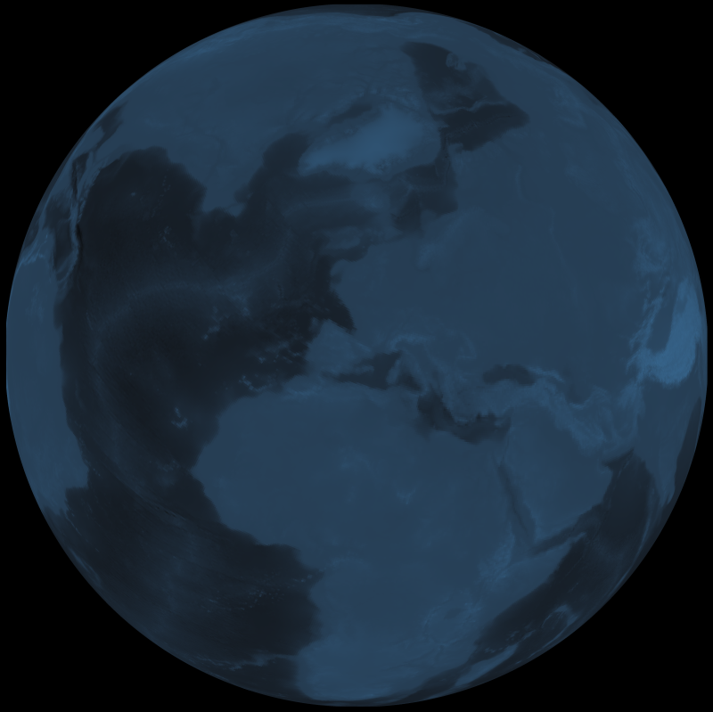

```{r knitr_setup, echo=FALSE}
opts_chunk$set(cache=FALSE, eval=FALSE, tidy=TRUE, message=FALSE, warning=FALSE)
read_chunk("app_traffic_example.R")
```

Here I share <iframe style="float: right; padding-left: 10px; padding-right: 10px" width="560" height="315" src="https://www.youtube.com/embed/uQYR91qixgo" frameborder="0" allowfullscreen></iframe> R code I used to produce <a href="https://www.youtube.com/watch?v=uQYR91qixgo">animated great circle arcs</a> on top of a rotating 3D Earth.
The code is not entirely reproducible but you should be able to use what is shared here to create your own video frames given your unique data and computing environment and resources.

When I make great circle animations, at the core of the process is always an R function that transforms a series of coordinates describing points along a great circle arc
into multiple series of great circle arc segments.
The goal is simple: plot a series of line segments, saving each plot as a subsequent still frame, rather than plotting the original entire arc as a single plot.
The input is generally a data table (much faster to work with than a data frame if you have a lot of data) with longitude and latitude columns
where the coordinates in each row describe a subsequent point along one of my paths.
I also use a third column to provide a unique group ID for each path to keep them distinct.

Before getting to this process, here is some example code of how I formatted my data this way when using the `geosphere` package.
Do not get bogged down in the details here. This is just an example for fuller context regarding my specific animation referenced above and I will not be focusing on it.
Your data will be quite different. You will have to arrange it similarly, but obviously it will be in a different context.

### Data prep example

As you can see below, all you need is a data frame with columns of longitude and latitude.
I created a `SpatialPoints` object from these.
In my case I wanted to connect great circle arcs between each of two specific locations and all other locations in my data set.
I marked the row indices for these two locations.

```{r data_prep_example}
```

`get_paths` uses `gcIntermediate` from the `geosphere` package to obtain vectors of points defining great circle arcs between my two locations and all others.
The resulting data frame has columns, `long`, `lat`, and `group`.
I do not break the arcs at the dateline because I intend to draw them on a 3D globe, but if I were making a flat map I would do so.
This is why the function handles the case of list output from `gcIntermediate` and adjusts the group ID by add 0.5 to one group.

Already more than enough details. You can see what I am going for though.
Given my data, I want to end up with columns of longitude and latitude defining great circle arcs and broken out by unique group IDs.
I show this because it's highly likely you will want to use `geosphere` in a similar way even if you won't be connecting points in the same way I am here.

### Transforming great circle arcs into segments

Okay. You have your data in the right format.
Now you want to break up your groups of great circle arcs into a larger number of nested subgroups of great circle arc segments.
Let's get some basic prep out of the way.
Here are the packages I am using.

#### The steup

```{r setup}
```

The `ggplot2` theme will allow for plotting without all the extraneous stuff like margins and axes and colors I don't want on my Earth.
The world map is an aside and has nothing to do with the great circles.
I include it here because it was part of my animation.
It will be used from plotting the backdrop of nation boundaries on the globe.
Having these underneath the great circle animation is helpful for geographic visual orientation.

It's not clear yet, but the reason for including the `raster` package is because I also use a rasterized map layer of the earth's surface as the bottom layer underneath the nation boundaries.
This is also an aside. It doesn't have anything to do with the great circle animation.

Yes, I am using R's built-in `parallel` package.
I happen to be do at least the parallelized operations in this project on a Linux server with 32 CPUs and 260 GB RAM.
I'm sorry to say but I can't help you if you want to do this on a local Windows pc for example.
If you rework the code for a much more restrictive environment, depending on your data, you may find yourself waiting forever for your output.
I just do not recommend doing this type of thing outside of a beefy server environment, at least if time is something you value.

Now, getting to the core of the process for real this time.
Here is the actual function I used for the above animation to break great circle arcs into smaller segments.

#### The main function

```{r gc_segments}
```

Going through the code, you can see it requires a minimum of 100 desired frames (which would make for quite a short video).
You can tweak the maximum number of points in a segment. The minimum is always two.
Each segment will vary in length uniformly between the minimum and maximum.

You can leave the data as is, with `direction="fixed"`. This assumes the ordering of points/rows pertaining to each group is intended to show direction.
Segments will be assembled in the same order.
Alternatively, you can reverse or even randomize the order if it doesn't matter for the given data.

This is just one example function.
You can make your own if this one does not generate the type of segments or provide the kind of random variation in segments you would like.

Let's go with 900 frames, which will result in about a 30 second video.
Recall that in my case I had two different data sets. I combine them at the end of the above code snippet.

```{r gc_segments_setup}
```

Here I make the new table below. It has a subgroup ID column as well as a frame ID column.
Group ID is now a decimal. To the left is the original great circle ID. To the right is the sequential segment ID.
The latter is random and not all great circle arcs are broken up into the same number of segments.
Some cover more rows of the table than others. They do not match up with the frame IDs and some recycling may be required if the number of desired frames is large enough.

```{r make_segs}
```

Alternatively, code like this will perform the same operation without using parallel processing.
This may not be terribly problematic if the data set is not too large.
I show this for comparison.
But the need for parallel will be much greater in later steps.

```{r make_segs_alt}
```

### Aside: the background layer 

##
#### Where I got the data
I use a rasterized bathymetry surface based on a csv file I downloaded by using the `marmap` package.
I won't discuss that here. Please see the `marmap` package for details and examples if this is important.
It is straightforward to use that package to download a local copy of a subregion of the data (or the whole map) at a specified resolution.

##
#### Projecting background layer to 3D

The `project_to_hemisphere` function below projects points onto the 3D earth and identifies which ones are within the hemisphere field of view given the centroid focal point.
Identifying the half which are out of view in any given frame allows me to toss them out for some added efficiency.
This is not actually a slow process. The conversion of coordinates is complex or demanding. The slow part is drawing the high resolution orthographic projection maps with `ggplot2`.

```{r marmap}
```

```{r hemisphere}
```

### Prepare for plotting

I want a 120-frame period, which is about four seconds of video, in which time I will complete one rotation of the earth.
I define a sequence of longitude values, but this I allow to repeat for the total number of video frames, `n.frames`, specified earlier.
Note that I keep the latitude focus (41 degrees) constant in this animation, but there is no reason this cannot vary as well.
In the `save_maps` function below, there is a hard-coded 23.4-degree fixed orientation, but this is something that can also be made variable.

While the data we are interested in - the great circle arc segments - will plot sequentially over a series of 900 frames,
both the nation boundaries and bathymetry surface map backdrops are constant so I only need to produce enough frames (120) for one rotation of each of those layers.

I split the path segments table on the frame ID. I will generate still frames in parallel.

In this animation I had originally chosen to aggregate my 10-minute resolution bathymetry surface from the `marmap` package
because that resolution was a bit too fine and even in parallel it was taking an extremely long time for `ggplot2` to draw the orthographic projection background maps.
If I understand correctly, it is drawing a ton of tiny, filled polygons. It really grinds to a halt if you have a massive amount of them.

#### Some setup

```{r plot_setup1}
```

Next, in parallel across frames, I project my rasterized background map cells to the 3D surface and retain only the ones which are in view in a given frame as the earth spins.
I use the full range of elevation data to retain a constant color palette mapping as cells at different extreme elevations move in and out of the field of view as the earth rotates.
I store the range in `z.range`. I add a frame ID column.
Finally I add a frame ID column for the nation boundaries table. The data is constant, but simply needs to be plotted 120 times in 3-degree shifts.

```{r plot_setup2}
```

### Save plots

I've showed the most important of two functions for making my great circle animation, `df_segs`,
which I use to transformed a table of grouped rows of great circle arc coordinates into a much larger one with nested, grouped, sequential arc segments.
The other critical function is `save_maps`.

Here I have generalized it a bit by adding a `type` argument.
It is primarily used for iterating over the data for each frame in a table produced by `df_segs` (the default `type="network"`).
This saves a map image of sequential great circle arc segments for each frame.

I added the options, `type="maplines"` and `type="maptiles"`.
The former is for the nation boundaries and the latter is for the rasterized map surface.

I call the function in parallel three times to cover each type of output.
I generate 120 frames (one earth rotation in three-degree increments) of both the nation boundaries and the surface tiles.
The latter takes by far the longest amount of time to process, far longer than even the 900 frames of network traffic itself.

#### The other main function

```{r plot_func}
```

### What about the video?

For any project like this I simply drop each of the three sequences of sequentially numbered png files onto its own timeline track as a still image sequence in a standard video editor.
I don't use R for this final step.
While I could have plotted everything together on a single sequence of frames, it doesn't make sense to do so even when each sequence has equal length.
This is because one sequence may take far longer to plot than another sequence.
It is more efficient to make a different image sequence for separate layers and mix them in the editor afterward.

You might also notice the very high pixel dimensions of the png outputs.
I do this in cases where I plan to zoom during an animation.
The larger the image, the more I can zoom in without degradation.
You can imagine that this generates a lot of data when you have thousands of frames and each image is several megabytes.

### Conclusion: Don't try this at home

Instead, try something like this on a server with plenty of CPUs and RAM. Otherwise try it with a small data set.
Due to the particular computing environment I used and the resources needed to process the frames in an efficient and timely fashion,
it is impossible to share this example animation code in a completely reproducible fashion.
However, you should be able to use `df_segs` or some alteration of it with a properly formatted input table
to generate the type of table you would want to pass subsequently to `save_maps` (or some alteration of that as well).

That is the gist of this example and should be enough to get you started.
Ultimately, you will have to adapt any code here to your unique data, its size and complexity, what exactly you want to do with it, and your available computing resources.
